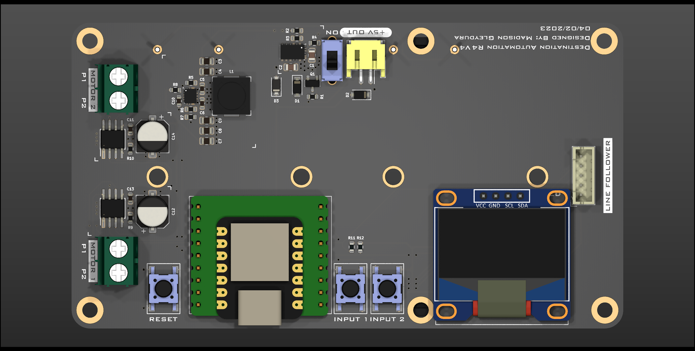
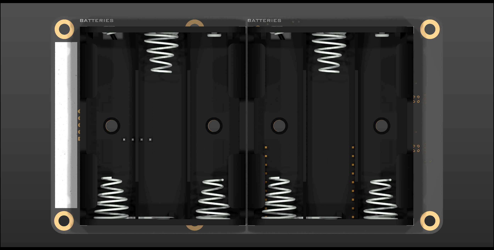
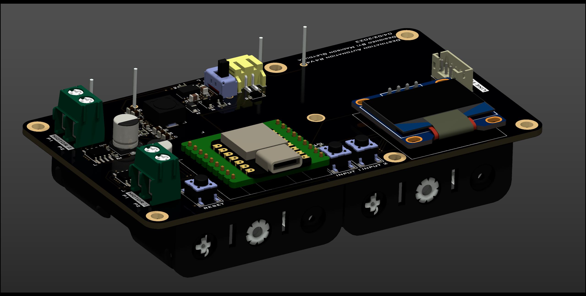
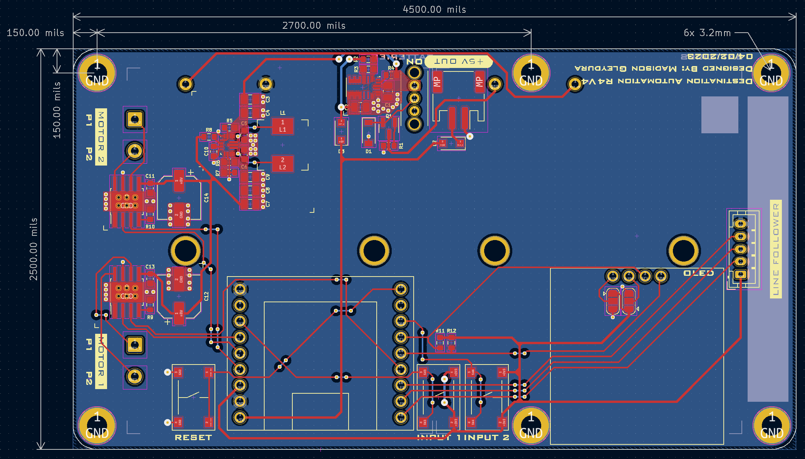

# Destination Automation R4 - Hardware
Hardware repository for the Destination Automation R4 robotic rover platform

## Features
- Seeeduino XIAO SAMD21 M0 microcontroller
- +5V & +8V voltage regulators
- 128x64 OLED display
- 2x DRV8871 full bridge motor drivers
- Line follwer connector (JST-PH)
- 2x input buttons

test
