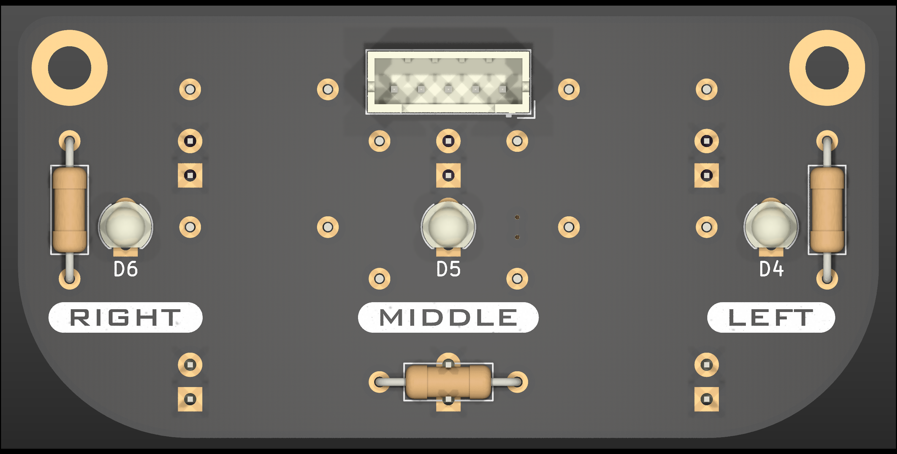
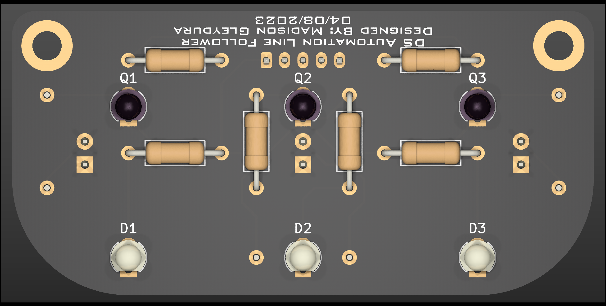
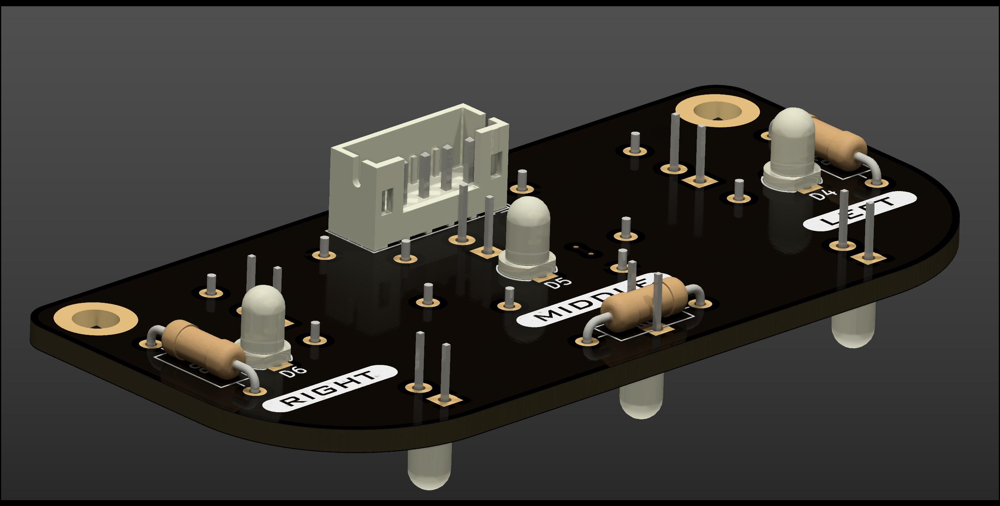
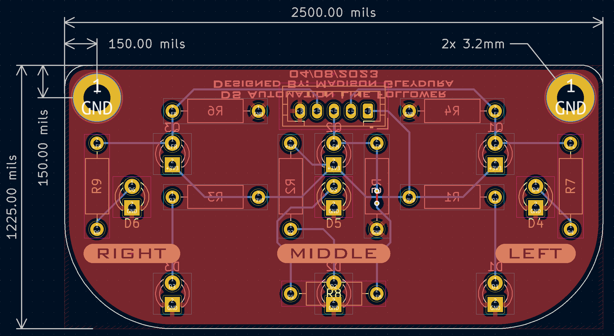

# Destination Automation R4 Line Follower - Hardware
Hardware for the Destination Automation R4 Line Follower

# Features
- 3x IR phototransistors (940mm)
- 3x IR photodiodes (940mm)
- 3x indicator LEDs (525nm)
- Rover connector (JST-PH)

